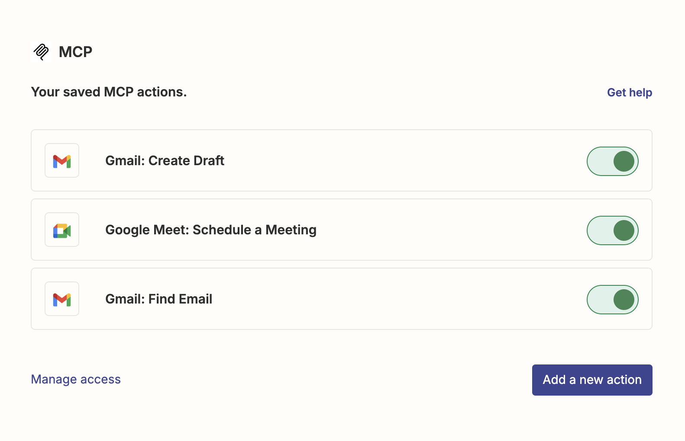

# mcp-supervisor

This repository combines two powerful LangChain projects to create a supervisor-based multi-agent architecture with MCP integration: 

### [LangGraph Supervisor Template](https://github.com/langchain-ai/langgraph-supervisor-py)
A ready-to-use template for quickly building supervisor-based multi-agent architectures in LangGraph. 

### [LangChain MCP Adapters](https://github.com/langchain-ai/langchain-mcp-adapters)
A repository that demonstrates how to integrate MCP servers within LangGraph applications. 

## Overview

This project showcases a nearly no-code approach to building AI assistants. 

- Create a supervisor-based multi-agent system with just a few lines of code
- Connect to external services like Zapier MCP (no-code MCP Server management) - https://zapier.com/mcp



*Simply include your Zapier MCP server URL in your environment variables, and all these tools become instantly available to your agents*


The repository is designed for immediate deployment to *LangGraph Cloud* using the [LangGraph Cloud Quick Start guide](https://langchain-ai.github.io/langgraph/cloud/quick_start/). When deployed to *LangGraph Cloud*, you automatically get *LangSmith* tracing for comprehensive monitoring and debugging. During development, *LangGraph Studio* provides a no-code environment for testing and debugging your application. 

For a quick and easy user interface, simply connect your application to [Agent Chat UI](https://github.com/langchain-ai/agent-chat-ui) - a pre-built, customizable UI designed specifically for LangGraph applications. This approach eliminates the need to build a frontend from scratch, allowing you to focus on your assistant's capabilities rather than implementation details.


This project leverages the complete LangChain stack for an end-to-end AI application:


## Getting Started

1. Clone this repository
   ```bash
   git clone https://github.com/yourusername/mcp-supervisor.git
   cd mcp-supervisor
   ```

2. Choose your LLM, agent architecture, and prompts
   - Modify `graph.py` to select your preferred LLM (default is GPT-4o)
   - Customize agent prompts and roles based on your use case
   - Define your tools:
     - Use existing MCP servers (like Zapier)
     - Create custom tools with LangChain

3. Deploy your application
   - Deploy to LangGraph Cloud (recommended) by setting your environment variables as shown in `.env.example`

4. Use your agent through Agent Chat UI
   - Connect your deployed application to Agent Chat UI for a ready-to-use interface
   - Interact with your multi-agent system through a user-friendly chat interface
   - Test and refine your agent's capabilities 


